# PortGO Authentication, Dashboard, Store, Ranking, Calendar, Questionnaire & Settings

A modern, responsive web app built with React, TypeScript, and Vite. The project includes a complete authentication flow (login, registration, and password recovery), a Home learning dashboard with study modules and daily challenges, a Store page for XP boosts and streak protection items, a Ranking page with a professional leaderboard experience, a Calendar page for monthly study planning, a full Questionnaire flow (grade selection, difficulty selection, quiz and review rounds), and a Settings page for profile and academic information management.

## 📸 Screenshots

### Home Page
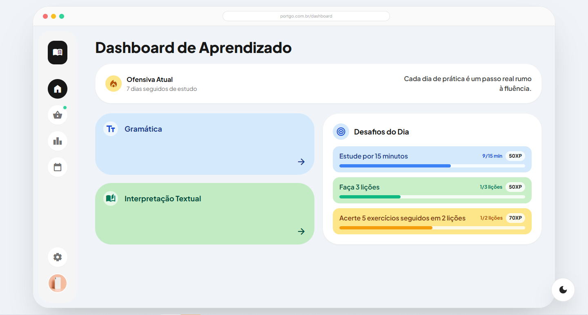

### Home Page (Mobile)
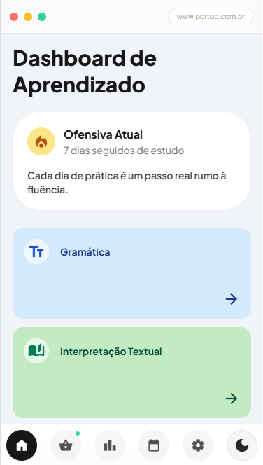

### Store Page
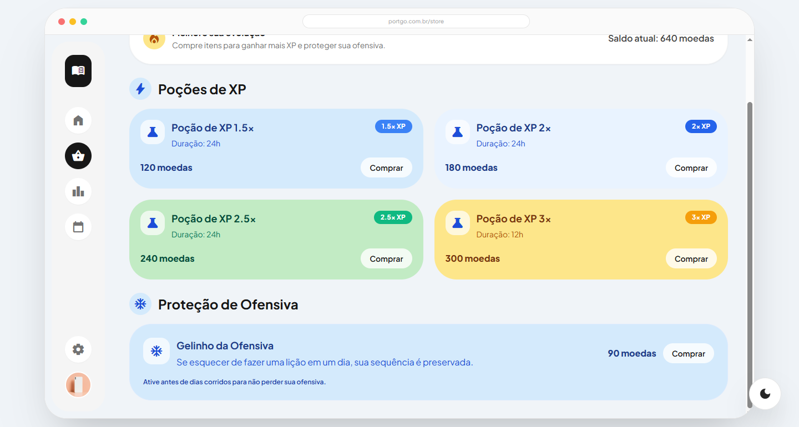

### Ranking Page
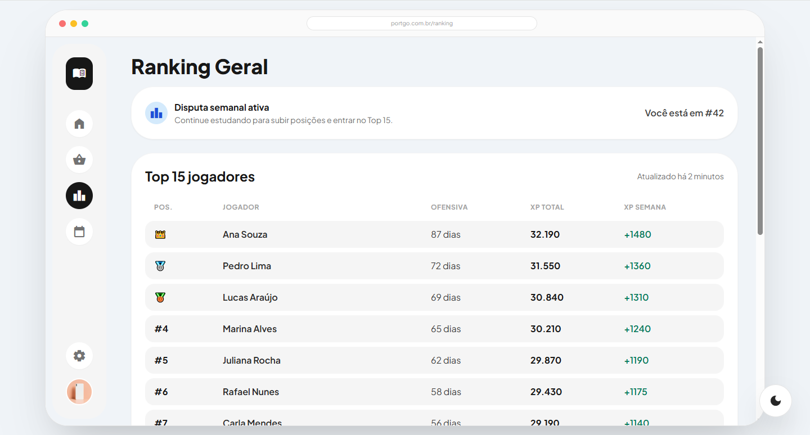

### Calendar Page
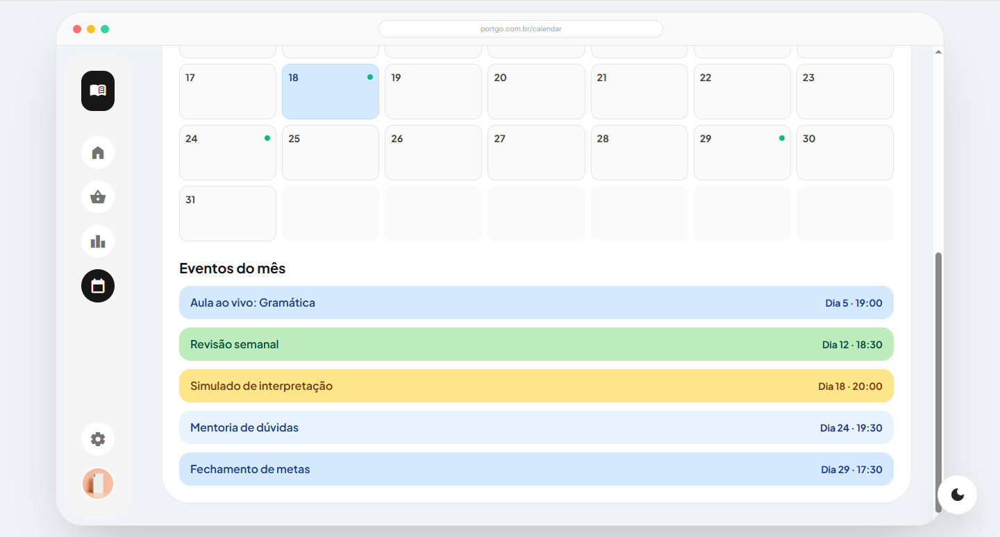

### Login Page
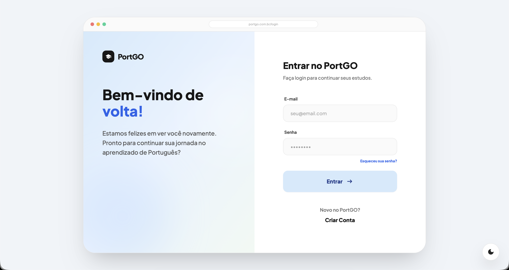

### Register Page
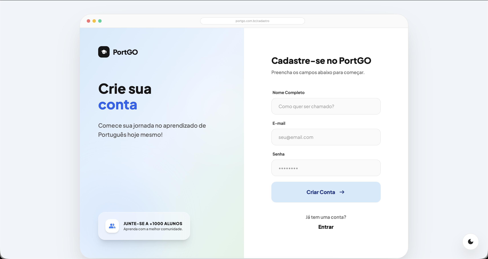

### Forgot Password Page


### Settings Page
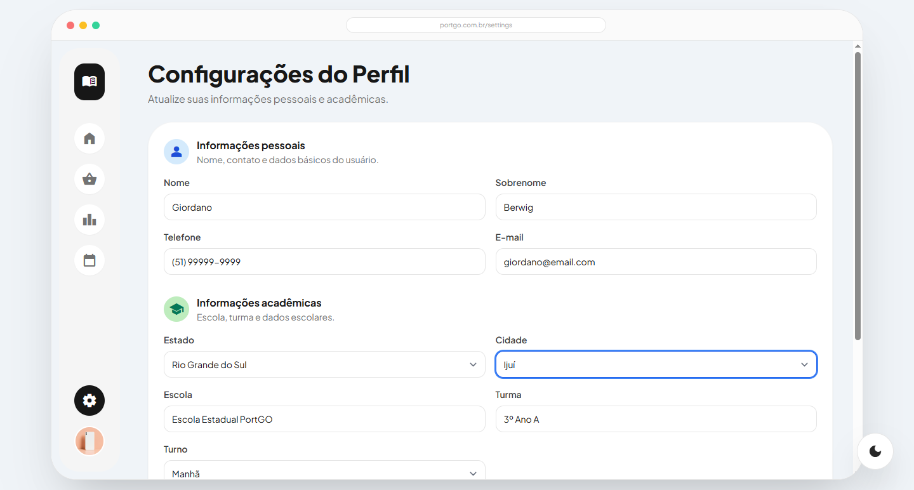

### Questionnaire - Step 1 (Grade Selection)
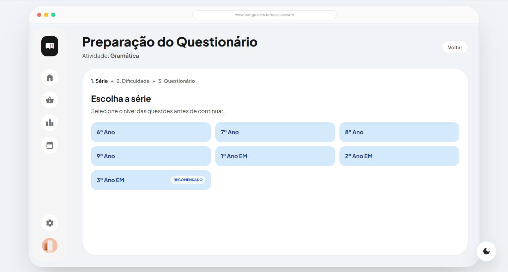

### Questionnaire - Step 2 (Difficulty Selection)
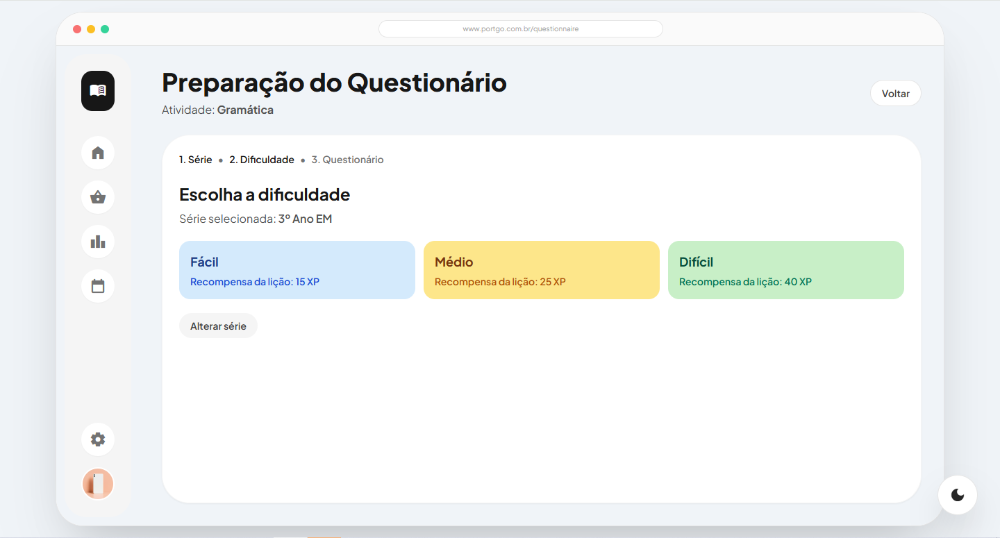

### Questionnaire - Step 3 (Ready State)
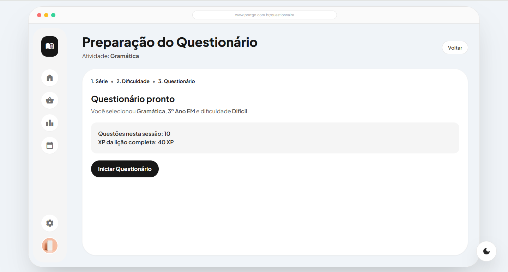

### Questionnaire - Quiz Running
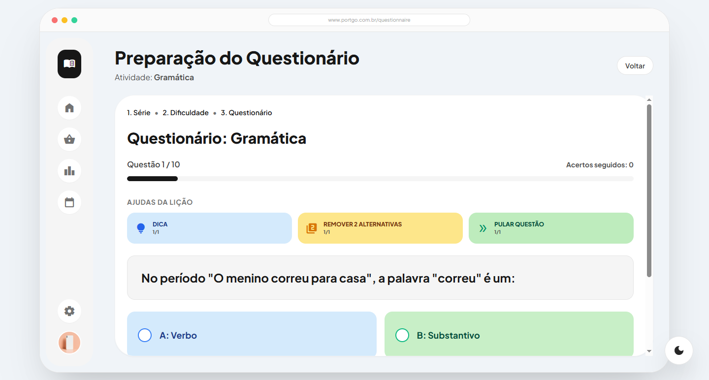

### Questionnaire - Completed Lesson
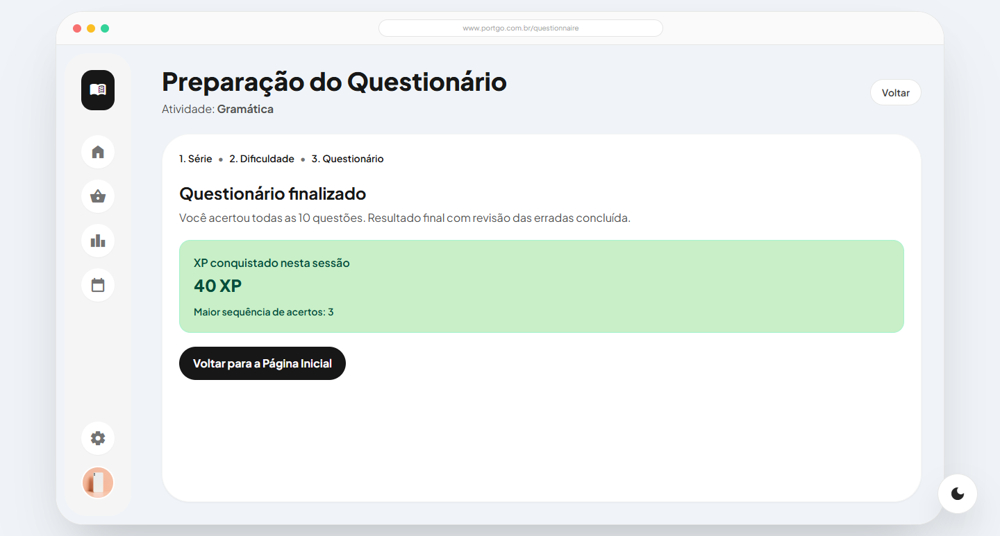

## ✨ Features

- 🔐 **Complete Authentication Flow with API Integration**
  - User login with email and password
  - User registration with first name, last name, and password confirmation
  - Password recovery via email
  - Password reset with token and email validation
  - API integration with Laravel backend (X-API-KEY header support)
  - Session management with 7-day expiration
  - Automatic session validation and cleanup
  - Logout functionality with session clearing

- 🛡️ **Route Protection**
  - Protected routes for authenticated users only
  - Public routes restricted to unauthenticated users
  - Automatic redirect based on authentication status
  - Session expiration handling
  - Study modules overview
  - Current streak highlight
  - Daily challenges with progress bars and XP badges

- 🛍️ **Store Page**
  - XP potion cards (1.5x, 2x, 2.5x, and 3x)
  - Streak Freeze (Gelinho da Ofensiva) item to protect the streak for one missed day
  - Purchase-focused layout with item highlights, price tags, and quick info panel

- 🏆 **Ranking Page**
  - Professional Top 15 leaderboard table
  - Highlighted row for the logged-in user with current position
  - Ranking summary panel with weekly awards and progression tips

- 📅 **Calendar Page**
  - Monthly grid calendar view
  - Event-day indicators for quick visualization
  - Compact monthly event list with date and time

- ⚙️ **Settings Page**
  - User profile form with personal and academic fields
  - Locked name and surname fields
  - Shift selector (morning, afternoon, full-time)
  - State and city selectors integrated with IBGE API
  - City selector enabled only after selecting a valid state

- 🧠 **Questionnaire Flow**
  - Activity-based entry from Home modules (Grammar and Reading)
  - Grade selection with recommended badge
  - Difficulty selection (easy, medium, hard)
  - Lesson XP reward by selected difficulty
  - 10 questions per lesson
  - Immediate feedback for correct/incorrect answers
  - Mandatory review rounds for wrong answers until all are correct
  - Help tools available once per lesson:
    - DICA
    - REMOVER 2 ALTERNATIVAS
    - PULAR QUESTÃO
  - Consecutive correct-answer streak tracking
  
- 🎨 **Modern UI/UX**
  - Clean and intuitive interface
  - Responsive design (mobile-first approach)
  - Split-panel layout with decorative left panel
  - Material Symbols icons integration
  
- 🌓 **Dark Mode Support**
  - Toggle between light and dark themes
  - Persistent theme preference
  - Smooth transitions between themes
  
- ♿ **Accessibility**
  - Semantic HTML
  - Proper form labels and ARIA attributes
  - Keyboard navigation support
  
- 📱 **Fully Responsive**
  - Works seamlessly on desktop, tablet, and mobile devices
  - Adaptive layouts for different screen sizes

## 🛠️ Tech Stack

- **React 19.2** - UI library
- **TypeScript** - Type safety
- **Vite 7.3** - Build tool and dev server
- **React Router DOM 7.13** - Client-side routing
- **Tailwind CSS** - Utility-first CSS (via custom config)
- **ESLint** - Code linting

## 📁 Project Structure

```
f-port-go/
├── src/
│   ├── App.tsx                      # Main app component with routing
│   ├── main.tsx                     # Application entry point
│   ├── index.css                    # Global styles
│   ├── components/                  # Shared components
│   │   ├── BrowserHeader.tsx
│   │   ├── DarkModeToggle.tsx
│   │   ├── EmailInput.tsx
│   │   ├── NameInput.tsx
│   │   ├── PasswordInput.tsx
│   │   ├── LeftPanel.tsx
│   │   ├── AppLeftSidebar.tsx
│   │   ├── ProtectedRoute.tsx       # Route protection for authenticated users
│   │   ├── PublicRoute.tsx          # Route protection for unauthenticated users
│   │   └── index.ts
│   ├── services/                    # API and business logic services
│   │   ├── auth.ts                  # Authentication API calls (login, register, forgot, reset)
│   │   └── session.ts               # Session management with expiration tracking
│   └── pages/                       # Page components
│       ├── Login/
│       │   ├── index.tsx
│       │   └── components/
│       │       ├── LoginForm.tsx
│       │       └── index.ts
│       ├── Register/
│       │   ├── index.tsx
│       │   └── components/
│       │       ├── RegisterForm.tsx
│       │       └── index.ts
│       ├── ForgotPassword/
│       │   ├── index.tsx
│       │   └── components/
│       │       ├── ForgotPasswordForm.tsx
│       │       └── index.ts
│       ├── ResetPassword/
│       │   ├── index.tsx
│       │   └── components/
│       │       ├── ResetPasswordForm.tsx
│       │       └── index.ts
│       └── Home/
│           ├── index.tsx
│           └── components/
│               ├── HomeContainer.tsx
│               ├── HomeLeftSidebar.tsx
│               ├── HomeMainContent.tsx
│               └── HomeRightPanel.tsx
│       └── Store/
│           ├── index.tsx
│           └── components/
│               ├── StoreContainer.tsx
│               ├── StoreLeftSidebar.tsx
│               ├── StoreMainContent.tsx
│               └── StoreRightPanel.tsx
│       └── Ranking/
│           ├── index.tsx
│           └── components/
│               ├── RankingContainer.tsx
│               ├── RankingLeftSidebar.tsx
│               ├── RankingMainContent.tsx
│               └── RankingRightPanel.tsx
│       └── Calendar/
│           ├── index.tsx
│           └── components/
│               ├── CalendarContainer.tsx
│               ├── CalendarLeftSidebar.tsx
│               ├── CalendarMainContent.tsx
│               └── CalendarRightPanel.tsx
│       └── Settings/
│           ├── index.tsx
│           └── components/
│               ├── SettingsContainer.tsx
│               ├── SettingsLeftSidebar.tsx
│               ├── SettingsMainContent.tsx
│               └── SettingsRightPanel.tsx
│       └── Questionnaire/
│           ├── index.tsx
│           ├── data.ts
│           ├── types.ts
│           └── components/
│               ├── DifficultySelectionStep.tsx
│               ├── FinishedStep.tsx
│               ├── GradeSelectionStep.tsx
│               ├── QuestionnaireRightPanel.tsx
│               ├── QuizStep.tsx
│               ├── ReadyStep.tsx
│               ├── StepIndicator.tsx
│               └── index.ts
├── public/                          # Static assets
├── README-images/                   # Screenshots for documentation
├── package.json
├── vite.config.ts
├── tsconfig.json
└── eslint.config.js
```

## 🚀 Getting Started

### Prerequisites

- Node.js (v18 or higher)
- npm or yarn

### Installation

1. Clone the repository:
```bash
git clone https://github.com/ggkooo/f-port-go.git
cd f-port-go
```

2. Install dependencies:
```bash
npm install
```

3. Start the development server:
```bash
npm run dev
```

4. Open your browser and navigate to `http://localhost:5173`

## 📜 Available Scripts

- `npm run dev` - Start the development server
- `npm run build` - Build for production
- `npm run preview` - Preview production build locally
- `npm run lint` - Run ESLint to check code quality

## 🎯 Usage

### Routes

- `/login` - Login page (public route)
- `/register` - Registration page (public route)
- `/forgot-password` - Password recovery page (public route)
- `/reset-password` - Password reset page with token validation (public route)
- `/` - Home dashboard page (protected route)
- `/store` - Store page (protected route)
- `/ranking` - Ranking page (protected route)
- `/calendar` - Calendar page (protected route)
- `/questionnaire` - Questionnaire page (protected route)
- `/settings` - Settings page (protected route)

### Components

#### Shared Components

- **EmailInput** - Reusable email input with validation
- **PasswordInput** - Password input with show/hide toggle and optional custom label
- **NameInput** - Name input component with optional custom label
- **DarkModeToggle** - Theme switcher component
- **BrowserHeader** - Mock browser chrome header
- **LeftPanel** - Decorative panel for authentication pages
- **AppLeftSidebar** - Navigation sidebar with logout functionality
- **ProtectedRoute** - Route wrapper for authenticated users only (redirects to `/login` if unauthenticated)
- **PublicRoute** - Route wrapper for unauthenticated users only (redirects to `/` if authenticated)

#### Page Components

Pages follow modular structures depending on the section:

- **Authentication pages** (`/login`, `/register`, `/forgot-password`, `/reset-password`)
  - Index component - Layout wrapper with form state management
  - Form component - Form logic, validation, and API submission
  - LeftPanel - Decorative panel for auth branding
  - Error/success messaging with visual feedback
  - Loading states on form submission

- **App pages** (`/`, `/store`, `/ranking`, `/calendar`, `/questionnaire`, `/settings`)
  - Index component - Browser-frame wrapper and page state management
  - LeftSidebar - Navigation with profile and logout actions
  - MainContent - Core page content
  - RightPanel - Contextual summary cards and quick info

## 🔌 API Configuration

The application integrates with a Laravel backend API running on `http://localhost:8000/api`. All authentication requests include the required `X-API-KEY` header for validation.

### Authentication Endpoints

- **POST** `/login` - User login
  - Request: `{ email: string, password: string }`
  - Response: `{ message: string, uuid: string, email: string, token: string }`

- **POST** `/register` - User registration
  - Request: `{ first_name: string, last_name: string, email: string, password: string, password_confirmation: string }`
  - Response: `{ message: string }`

- **POST** `/forgot-password` - Request password reset token
  - Request: `{ email: string }`
  - Response: `{ message: string }`

- **POST** `/reset-password` - Reset password with token
  - Request: `{ token: string, email: string, password: string }`
  - Response: `{ message: string }`

### Session Management

Sessions are stored in `sessionStorage` with automatic expiration after 7 days. The session includes:
- `uuid` - User unique identifier
- `email` - User email address
- `token` - Authentication token for API requests

Session validation occurs on every app initialization and when accessing protected routes.

### Services

Services handle API communication and business logic:

- **auth.ts** - Authentication API service
  - `login(payload)` - Authenticate user and return session data
  - `register(payload)` - Create new user account
  - `forgotPassword(payload)` - Request password reset token
  - `resetPassword(payload)` - Reset password with token
  - Centralized API error handling with validation message extraction
  - X-API-KEY header injection for all requests

- **session.ts** - Session management service
  - `saveSession(session)` - Store user session with 7-day expiration
  - `getSession()` - Retrieve valid session or null if expired
  - `isSessionValid()` - Check if user has active session
  - `clearSession()` - Remove session data (logout)
  - `getSessionToken()` - Get authentication token from session
  - Automatic expiration validation and cleanup

## 🎨 Styling

The application uses Tailwind CSS for styling with a custom dark mode implementation. The color scheme includes:

- **Primary**: Blue tones (#D4EAFC, #C2E2FF)
- **Accent**: Emerald for highlights
- **Neutral**: Comprehensive grayscale palette
- **Dark mode**: Full support with neutral-900 backgrounds

## 🔧 Configuration

### TypeScript

The project uses strict TypeScript configuration split into:
- `tsconfig.app.json` - Application code
- `tsconfig.node.json` - Build tooling

### Vite

Minimal Vite configuration with React plugin enabled. See [vite.config.ts](vite.config.ts) for details.

### ESLint

Modern flat config format with React-specific rules. See [eslint.config.js](eslint.config.js) for the complete setup.

## 🤝 Contributing

1. Fork the project
2. Create your feature branch (`git checkout -b feature/AmazingFeature`)
3. Commit your changes (`git commit -m 'Add some AmazingFeature'`)
4. Push to the branch (`git push origin feature/AmazingFeature`)
5. Open a Pull Request

## 📝 License

This project is private and not licensed for public use.

## 🙏 Acknowledgments

- Material Symbols for icons
- React community for excellent tooling
- Vite team for the blazing-fast build tool

---

Built with ❤️ using React, TypeScript, and Vite
